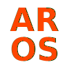

# AROS Technologies - Corporate Website



This repository contains the source code for the official AROS Technologies corporate landing page. Built with performance, accessibility, and modern aesthetics in mind, this site serves as the digital storefront for our enterprise software solutions.

## 🚀 Tech Stack

- **Framework:** [React 18](https://reactjs.org/) + [Vite](https://vitejs.dev/)
- **Language:** [TypeScript](https://www.typescriptlang.org/)
- **Styling:** Vanilla CSS (Neo-brutalist / Glassmorphism UI)
- **Localization:** `react-i18next` (English & Spanish support)
- **Icons:** [Lucide React](https://lucide.dev/)
- **CI/CD:** GitHub Actions -> GoDaddy cPanel FTP Deployment

## 📂 Project Structure

```
├── .github/workflows/      # Automated deployment pipelines (GoDaddy FTP)
├── Identity/Logotipos/     # Source brand assets and raw logos
├── public/                 # Static assets (favicons, manifests)
├── src/
│   ├── assets/             # Internal React assets
│   ├── components/         # Reusable UI components & Pages
│   │   ├── Navbar.tsx      # Main navigation with active state tracking
│   │   ├── Hero.tsx        # Dynamic hero section
│   │   ├── Metrics.tsx     # Animated impact metrics
│   │   ├── Services.tsx    # Enterprise services page
│   │   ├── Demos.tsx       # Interactive products showcase
│   │   └── ...
│   ├── locales/            # i18n translation files
│   │   ├── en.json         # English translations
│   │   └── es.json         # Spanish translations
│   ├── App.tsx             # Main application router and hash state manager
│   ├── index.css           # Global CSS variables and utility classes
│   └── main.tsx            # Application entry point
```

## 🛠️ Local Development

1. **Install Dependencies:**
   ```bash
   npm install
   ```

2. **Run Development Server:**
   ```bash
   npm run dev
   ```
   *The site will be available at `http://localhost:5173`.*

3. **Build for Production:**
   ```bash
   npm run build
   ```
   *Compiles a highly optimized bundle into the `/dist` directory.*

## 🌍 Localization (i18n)

The site natively supports English and Spanish. To modify text, update the JSON files located in `src/locales/`. The translation keys are deeply nested to keep component text organized.

Example:
```json
// src/locales/en.json
"hero": {
  "title_highlight": "WITH TECHNOLOGY."
}
```

## 🚢 Automated Deployment

This project uses **GitHub Actions** for CI/CD. 
Whenever code is pushed or merged into the `main` branch, the `Deploy to GoDaddy cPanel` workflow automatically runs.

It executes the following sequence:
1. Provisions an Ubuntu runner.
2. Installs Node.js & NPM dependencies.
3. Runs the Vite build process.
4. Securely transfers the compiled `/dist` contents to the GoDaddy server via FTP.

**To modify deployment secrets**, go to GitHub Repository Settings -> Secrets and variables -> Actions, and update:
- `FTP_SERVER`
- `FTP_USERNAME`
- `FTP_PASSWORD`

---
*© 2026 AROS Technologies. All rights reserved.*
